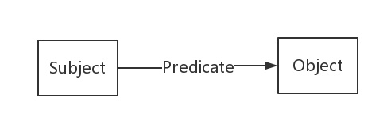
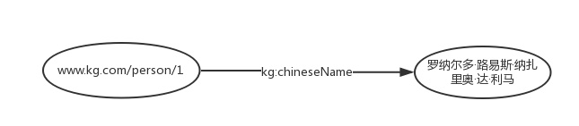

<!-- TOC -->

- [RDF](#RDF)
  - [知识图谱的基石](#知识图谱的基石)
  - [RDF的三种类型](#RDF的三种类型)
  
<!-- /TOC-->

## RDF
### 知识图谱的基石
- 知识图谱是由一些相互连接的**实体**和他们的**属性**构成的。
- 知识图谱是由一条条知识组成，每条知识表示为一个SPO三元组(Subject-Predicate-Object)。
- 在知识图谱中，我们用RDF形式化地表示这种三元关系。
- RDF(Resource Description Framework)，即资源描述框架，是W3C制定的，用于描述实体/资源的标准数据模型。

### RDF的三种类型
- RDF图中一共有三种类型，International Resource Identifiers(IRIs)，blank nodes 和 literals。
- 下面是SPO每个部分的类型约束：
    - Subject可以是IRI或blank node。
    - Predicate是IRI。
    - Object三种类型都可以。
- IRI我们可以看做是URI或者URL的泛化和推广，它在整个网络或者图中唯一定义了一个实体/资源，和我们的身份证号类似。
- literal是字面量，我们可以把它看做是带有数据类型的纯文本。
- blank node简单来说就是没有IRI和literal的资源，或者说匿名资源。
- 示例：
    - 罗纳尔多的中文名是罗纳尔多·路易斯·纳扎里奥·达·利马”这样一个三元组用RDF形式来表示：

>"www.kg.com/person/1"
>是一个IRI，用来唯一的表示“罗纳尔多”这个实体。
>"kg:chineseName"也是一个IRI，用来表示“中文名”这样一个属性。"kg:"是RDF文件中所定义的prefix，如下所示。
>>@prefix kg: <http://www.kg.com/ontology/>
>>>kg:chineseName其实就是"http:// www.kg.com/ontology/chineseName"的缩写。

- 我们其实可以认为知识图谱就包含两种节点类型，资源和字面量。借用数据结构中树的概念，字面量类似叶子节点，出度为0。
