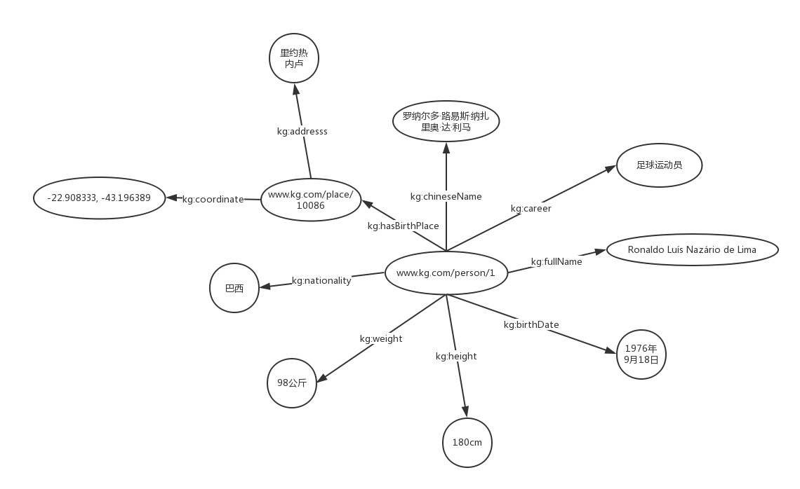

<!-- TOC -->

- [RDF](#RDF)
  - [知识图谱的基石](#知识图谱的基石)
  - [RDF的三种类型](#RDF的三种类型)
  
<!-- /TOC-->

## RDF
### 知识图谱的基石
- 知识图谱是由一些相互连接的**实体**和他们的**属性**构成的。
- 知识图谱是由一条条知识组成，每条知识表示为一个SPO三元组(Subject-Predicate-Object)。
- 在知识图谱中，我们用RDF形式化地表示这种三元关系。
- RDF(Resource Description Framework)，即资源描述框架，是W3C制定的，用于描述实体/资源的标准数据模型。

### RDF的三种类型
- RDF图中一共有三种类型，International Resource Identifiers(IRIs)，blank nodes 和 literals。
- 下面是SPO每个部分的类型约束：
    - Subject可以是IRI或blank node。
    - Predicate是IRI。
    - Object三种类型都可以。
- IRI我们可以看做是URI或者URL的泛化和推广，它在整个网络或者图中唯一定义了一个实体/资源，和我们的身份证号类似。
- literal是字面量，我们可以把它看做是带有数据类型的纯文本。
- blank node简单来说就是没有IRI和literal的资源，或者说匿名资源。
- 示例：
    - 罗纳尔多的中文名是罗纳尔多·路易斯·纳扎里奥·达·利马”这样一个三元组用RDF形式来表示：

>"www.kg.com/person/1"
>是一个IRI，用来唯一的表示“罗纳尔多”这个实体。
>"kg:chineseName"也是一个IRI，用来表示“中文名”这样一个属性。"kg:"是RDF文件中所定义的prefix，如下所示。
>>@prefix kg: <http://www.kg.com/ontology/>
>>>kg:chineseName其实就是"http:// www.kg.com/ontology/chineseName"的缩写。

- 我们其实可以认为知识图谱就包含两种节点类型，资源和字面量。借用数据结构中树的概念，字面量类似叶子节点，出度为0。

### RDF序列化方法
- RDF/XML，顾名思义，就是用XML的格式来表示RDF数据。之所以提出这个方法，是因为XML的技术比较成熟，有许多现成的工具来存储和解析XML。然而，对于RDF来说，XML的格式太冗长，也不便于阅读，通常我们不会使用这种方式来处理RDF数据。
- N-Triples，即用多个三元组来表示RDF数据集，是最直观的表示方法。在文件中，每一行表示一个三元组，方便机器解析和处理。开放领域知识图谱DBpedia通常是用这种格式来发布数据的。
- Turtle, 应该是使用得最多的一种RDF序列化方式了。它比RDF/XML紧凑，且可读性比N-Triples好。
- RDFa, 即“The Resource Description Framework in Attributes”，是HTML5的一个扩展，在不改变任何显示效果的情况下，让网站构建者能够在页面中标记实体，像人物、地点、时间、评论等等。也就是说，将RDF数据嵌入到网页中，搜索引擎能够更好的解析非结构化页面，获取一些有用的结构化信息。
- JSON-LD，即“JSON for Linking Data”，用键值对的方式来存储RDF数据。
- 我们结合罗纳尔多知识图的例子，给出其N-Triples和Turtle的具体表示。
>Example1 N-Triples:

><http://www.kg.com/person/1> <http://www.kg.com/ontology/chineseName> "罗纳尔多·路易斯·纳萨里奥·德·利马"^^string.  
><http://www.kg.com/person/1> <http://www.kg.com/ontology/career> "足球运动员"^^string.  
><http://www.kg.com/person/1> <http://www.kg.com/ontology/fullName> "Ronaldo Luís Nazário de Lima"^^string.  
><http://www.kg.com/person/1> <http://www.kg.com/ontology/birthDate> "1976-09-18"^^date.  
><http://www.kg.com/person/1> <http://www.kg.com/ontology/height> "180"^^int.  
><http://www.kg.com/person/1> <http://www.kg.com/ontology/weight> "98"^^int.  
><http://www.kg.com/person/1> <http://www.kg.com/ontology/nationality> "巴西"^^string.  
><http://www.kg.com/person/1> <http://www.kg.com/ontology/hasBirthPlace> <http://www.kg.com/place/10086>.  
><http://www.kg.com/place/10086> <http://www.kg.com/ontology/address> "里约热内卢"^^string.  
><http://www.kg.com/place/10086> <http://www.kg.com/ontology/coordinate> "-22.908333, -43.196389"^^string.  

- 用Turtle表示的时候我们会加上前缀（Prefix）对RDF的IRI进行缩写。
>Example2 Turtle:  

>@prefix person: <http://www.kg.com/person/> .  
>@prefix place: <http://www.kg.com/place/> .  
>@prefix : <http://www.kg.com/ontology/> .  

>person:1 :chineseName "罗纳尔多·路易斯·纳萨里奥·德·利马"^^string.  
>person:1 :career "足球运动员"^^string.  
>person:1 :fullName "Ronaldo Luís Nazário de Lima"^^string.  
>person:1 :birthDate "1976-09-18"^^date.  
>person:1 :height "180"^^int.   
>person:1 :weight "98"^^int.  
>person:1 :nationality "巴西"^^string.   
>person:1 :hasBirthPlace place:10086.  
>place:10086 :address "里约热内卢"^^string.  
>place:10086 :coordinate "-22.908333, -43.196389"^^string.  

- 同一个实体拥有多个属性（数据属性）或关系（对象属性），我们可以只用一个subject来表示，使其更紧凑。我们可以将上面的Turtle改为：
>Example3 Turtle:  

>@prefix person: <http://www.kg.com/person/> .  
>@prefix place: <http://www.kg.com/place/> .  
>@prefix : <http://www.kg.com/ontology/> .  

>person:1 :chineseName "罗纳尔多·路易斯·纳萨里奥·德·利马"^^string;  
>&nbsp;&nbsp;&nbsp;&nbsp;&nbsp;&nbsp;&nbsp;&nbsp;&nbsp;&nbsp;&nbsp;&nbsp;&nbsp;&nbsp;&nbsp;&nbsp;:career "足球运动员"^^string;  
>         :fullName "Ronaldo Luís Nazário de Lima"^^string;  
>         :birthDate "1976-09-18"^^date;  
>         :height "180"^^int;  
>         :weight "98"^^int;  
>         :nationality "巴西"^^string;   
>         :hasBirthPlace place:10086.  
>place:10086 :address "里约热内卢"^^string;  
>            :coordinate "-22.908333, -43.196389"^^string.  
