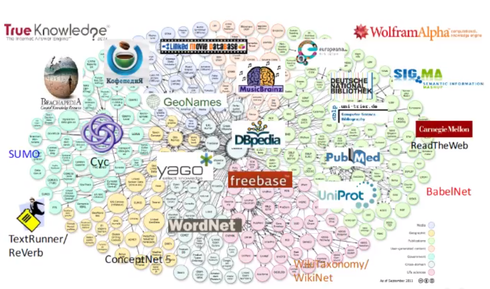
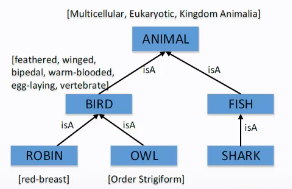
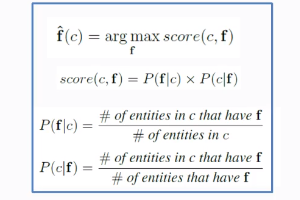
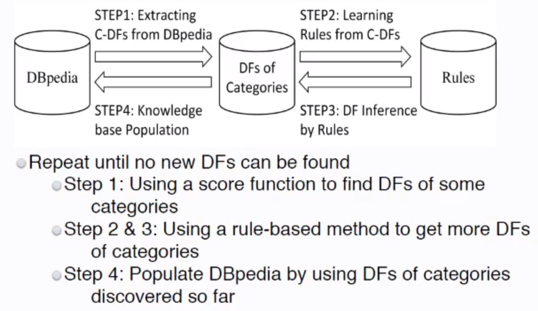
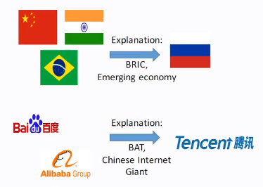
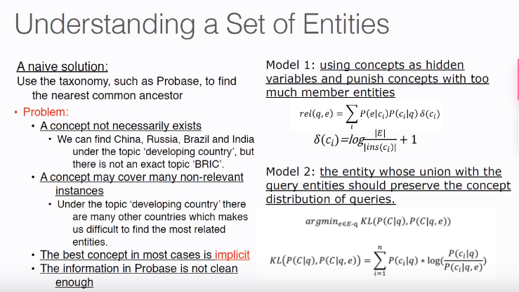
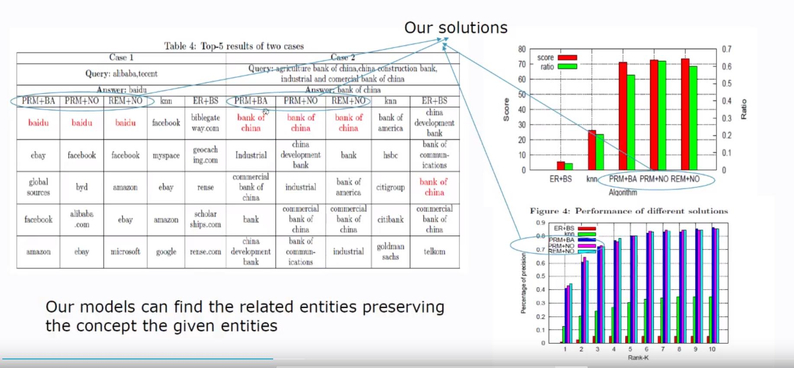
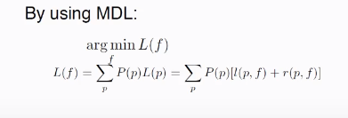

<!-- TOC -->
- [语言理解](#语言理解)
  - [为什么需要语言理解](#为什么需要语言理解)
  - [语言理解的障碍](#语言理解的障碍)
- [知识图谱](#知识图谱)
- [如何利用知识图谱去使机器具备自然语言理解的能力](#如何利用知识图谱去使机器具备自然语言理解的能力)
  - [理解人类语言](#理解人类语言)
  - [具备语言认知能力](#具备语言认知能力)
  - [如何让机器理解一个概念](#如何让机器理解一个概念)
  - [如何挖掘DifiningFeatrues](#如何挖掘DifiningFeatrues)
  - [流程框架](#流程框架)
  - [理解一组实体](#理解一组实体)
  - [理解动词短语](#理解动词短语)
<!-- /TOC-->

## 语言理解
### 为什么需要语言理解
- 语言是思考的工具
- 语言的表达能力和理解能力使我们区别于动物
- 所以使机器能够理解人类的语言是**实现智能信息处理和智脑**一个关键环节

### 语言理解的障碍
- 机器理解语言需要**背景知识库**，对知识库的要求
  - 规模足够大
  - 语义关系要足够丰富
  - 结构友好（需要提供给计算机容易处理的结构）
- 传统的知识表示形式不能满足这些需求
  - 本体（Ontology）：实体的覆盖率有限
  - 语义网络（Semantic Network）：传统的语义网络关系单一，在语义的多样性上有局限
  - 文本：传统的自由文本结构不友好，是非结构化的
- 以知识图谱为知识表现形式可以解决以上问题

## 知识图谱
  - 本质：**是一个大规模的语义网络，有大量的实体，概念及其之间的语义关系构成。**
  - 优点：
      - 实体和概念的高覆盖率
      - 丰富的语义关系
      - 以[RDF](https://www.jianshu.com/p/5a9135b6f017)的形式存储
      - 以众包的形式保证数据的质量
          - 众包：使用人工校验
  - 为什么知识图谱能成为大数据时代的知识表现形式
      - 理解语义关系需要大量背景知识
      - 机器智脑需要背景知识库去认知世界
      
   

## 如何利用知识图谱去使机器具备自然语言理解的能力
### 理解人类语言
  - 理解一组概念/类别（category）
  - 理解一群实体/一组实例
  - 理解词袋（a bag of words）：打标签
  - 理解动词短语
  - 理解短文本
  - 理解自然语言的句子或者问题
  - 推理一些遗漏的事实
  
 ### 具备语言认知能力
  - 归类(Categorization)
    - Sex=man,Marriage status=unmarried  -> Bachelor
  - 概念化(Conceptualization)
    - Newton -> Scientist
  - 联想(Association)
    - Mircrosoft -> Bill Gates
  - 推理(Inference)
    - Man has brain,brain can think ->Man can think
  - 归纳/总结(Induction/summarization)
    - Ceremony,bride,rose -> wedding
   
  ### 如何让机器理解一个概念
  - 我们人类如何理解一个新概念
    - Bachelor:Sex=man,Marriage status=unmarried
    - 上面的例子可以看出，我们在学习一个新的概念时，需要找到许多单身汉具备的属性，然后这些属性赋值组合成了单身汉的定义
  - 如何定义一个Concept/Category？
  - **我们需要找到一组属性，这组属性是定义Category的充分必要条件(necessary and sufficient)**
    - **任何具有这些属性的实体都应该属于这个Category**
    - **任何属于这个Category的实体都应该具备这些属性**
  - 所以要让机器理解一个Category，就需要先挖掘Defining Features
  - E.g, Category "Jay Chou albums"
    - Defining Featrues:
      - {(Type,album),(Singer,Jay Chou)}
      - 这两个属性就可以准确的定义了周杰伦专辑这个Category
    - Non-Defining Features
      - {(Type,album),(Singer,Jay Chou),(genre,Pop music)}
      - {(Type,single),(Singer,Jay Chou)}
      
  

  
  ### 如何挖掘DifiningFeatrues
  - 语义知识库中(DBpedia,CN-DBpedia等)有许多实体，每个实体中又有许多属性，这些属性组合很有可能就有我们需要的Defining features
  - 一个实体中含有许多属性，但是并不是所有的**属性组合**都是我们所需要的Defining features
  - 如何测量属性的可用程度
    

  - 挑战和解决方法
    - 挑战：实体的属性组合空间是指数级的
    - 解决方法：挖掘频繁模式去发现哪些属性组合是足够频繁的
 
 ### 流程框架
 

 
 ### 理解一组实体
 

 
  - 给了机器一组实体，机器能否理解这组实例**内在的联系，并且推荐出最合适的实体**
    - 中国，印度，巴西（金砖国家，发展中国家）-> 俄罗斯
    - 百度，阿里（BAT,中国互联网巨头）-> 腾讯
  - 实际应用场景
    - E.g,如果用户在电商平台上搜索三星S6,iPhone6等高端机型，那你一定希望平台能给你推荐相同价位的其他机型，而不是老人机，或者其他比较低端的机型。
  - 下面的是复旦老师的算法和算法应用的结果
   

   

  
 ### 理解动词短语
 - E.g, I watched The Amazing Spider-man 2 and thought it's impressive（令人钦佩的）
  - 那么机器如何通过动词"watch"去理解"The Amazing Spider-man 2"这个obj的呢
  - 在watch的匹配模式中有watch $movie这种模式，所以"The Amazing Spider-man 2"就会被理解成一个电影名
 - **Model:extract the patterns of verb phrases**
 - Applications:
  - 概念化常用的动词:
  - The apple(obj) he ate(verb) yesterday has a bad taste.
  - Pattern: eat $food -> apple is a $food
  - 如果机器之前并没有apple这个对象的概念，当它匹配到eat $food这个模式后，就可以推理出apple是一种food
    

 
 - 这种Model可能会遇到的问题
  - 成语，俚语等固定搭配（idiom patterns）:Kick the ass/ watch step(小心行事)
    - 这种固定搭配，搭配的意思不是词组的本义，这种概念化动词毫无意义
  - 概念化模式：eat fruit(apple/banana etc.) drink beverage(wine,tea etc.)
    - fruit概念化比apple等更好，范围更广。（但是apple不应该比fruit更准确吗）
  - 将大量的动词短语做概念化的时候容易遇到两个极端的问题Generality和Specificity
    - Generality(概括)：One general pattern is better than several specific pattern.
    - Specificity(具体)：A pattern's assigned entities and the pattern itself should be matched
       

       
  - over specificity：啥事都不做，也是一种概念化
  - over generality:概括的太过宽泛，可以看到这个概念化包含了太多不需要的实体
  - 算法：
   

 
 
  
   
